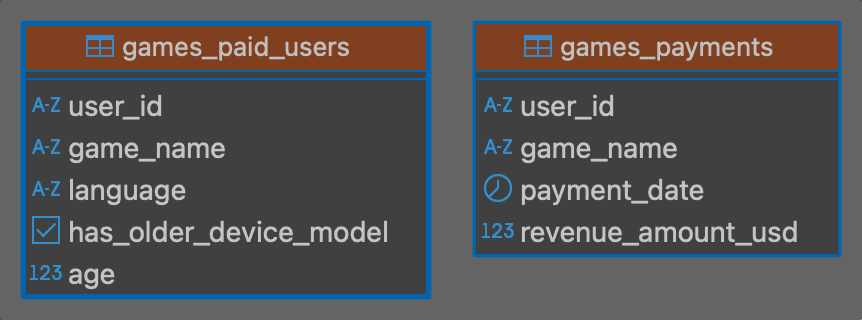
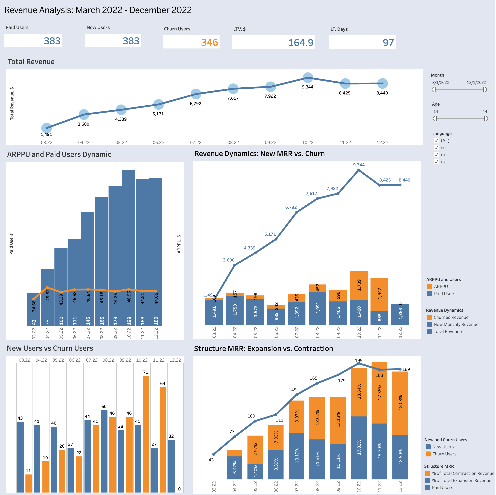

# Revenue Analysis
## Introduction

This project presents an in-depth analysis of revenue trends between March and December 2022. The data used in this analysis was extracted using an SQL query and then visualized using Tableau to provide clear and insightful representations of the findings.

**The analysis focuses on answering the following key questions:**

* **Factors influencing revenue:**  How do new user acquisition and customer churn affect overall revenue?
* **Revenue trends over time:** Are there noticeable patterns of growth, decline, or stability in revenue throughout the analyzed period?
* **Conclusions and recommendations:** What actionable insights can be derived from the analysis to improve revenue performance?
## Data Sources

The data for this project was extracted from a PostgreSQL database containing two primary tables:

* **games_paid_users:** Contains information about users who have made in-app purchases, including their user ID, game name, language, device model (whether it's an older model), and age.
* **games_payments:** Contains information about payments made within the games, including the user ID, game name, payment date, and revenue amount in USD.
## Tools

The following tools were used in this project:

* **DBeaver:** A free and open-source universal database tool used to connect to the PostgreSQL database, query the data, and export it for analysis.
* **Tableau Public:** A free platform for creating interactive data visualizations. Tableau Public was used to create charts and dashboards to analyze and present the revenue data.
## SQL Query

The following SQL query was used to extract and prepare the data for analysis:

~~~SQL
WITH monthly_revenue AS (
    SELECT 
        DATE_TRUNC('month', payment_date)::DATE AS payment_month,
        user_id,
        game_name,
        SUM(revenue_amount_usd) AS total_revenue
    FROM 
        project.games_payments
    GROUP BY 
        1, 2, 3
), 

calculated_metrics AS (
    SELECT 
        mr.*,
        COALESCE(LAG(payment_month) OVER (PARTITION BY user_id ORDER BY payment_month), DATE '1970-01-01') AS previous_paid_month,
        COALESCE(LAG(total_revenue) OVER (PARTITION BY user_id ORDER BY payment_month), 0) AS previous_paid_month_revenue,
        MAX(payment_month) OVER (PARTITION BY user_id) AS last_paid_month,
        LEAD(payment_month) OVER (PARTITION BY user_id ORDER BY payment_month) AS next_paid_month,
        DATE(payment_month + INTERVAL '1' MONTH) AS next_calendar_month,
        CASE 
            WHEN LAG(payment_month) OVER (PARTITION BY user_id ORDER BY payment_month) IS NULL 
            THEN total_revenue 
            ELSE 0
        END AS new_mrr,
        CASE 
            WHEN LAG(payment_month) OVER (PARTITION BY user_id ORDER BY payment_month) IS NULL 
            THEN 1 
            ELSE 0
        END AS new_users,
        CASE 
            WHEN (LEAD(payment_month) OVER (PARTITION BY user_id ORDER BY payment_month) IS NULL 
                AND payment_month < MAX(payment_month) OVER ()) 
                OR (LEAD(payment_month) OVER (PARTITION BY user_id ORDER BY payment_month) != DATE(payment_month + INTERVAL '1' MONTH))
            THEN 1 
            ELSE 0
        END AS churn_users,
        CASE 
            WHEN MAX(payment_month) OVER (PARTITION BY user_id) = payment_month 
            THEN total_revenue 
            ELSE 0
        END AS churn_revenue,
        CASE 
            WHEN LEAD(payment_month) OVER (PARTITION BY user_id ORDER BY payment_month) IS NULL 
                OR LEAD(payment_month) OVER (PARTITION BY user_id ORDER BY payment_month) != DATE(payment_month + INTERVAL '1' MONTH)
            THEN total_revenue 
            ELSE 0
        END AS churned_revenue,
        CASE 
            WHEN LAG(payment_month) OVER (PARTITION BY user_id ORDER BY payment_month) = DATE(payment_month - INTERVAL '1' MONTH) 
                AND total_revenue > LAG(total_revenue) OVER (PARTITION BY user_id ORDER BY payment_month) 
            THEN total_revenue - LAG(total_revenue) OVER (PARTITION BY user_id ORDER BY payment_month)
            ELSE 0
        END AS expansion_revenue,
        CASE 
            WHEN LAG(payment_month) OVER (PARTITION BY user_id ORDER BY payment_month) = DATE(payment_month - INTERVAL '1' MONTH) 
                AND total_revenue < LAG(total_revenue) OVER (PARTITION BY user_id ORDER BY payment_month) 
            THEN LAG(total_revenue) OVER (PARTITION BY user_id ORDER BY payment_month) - total_revenue
            ELSE 0
        END AS contraction_revenue
    FROM 
        monthly_revenue mr
)

SELECT 
    cm.user_id,
    pu.language,
    pu.age,
    cm.payment_month,
    cm.total_revenue,
    cm.new_mrr,
    cm.new_users,
    cm.churn_users,
    cm.churn_revenue,
    cm.churned_revenue,
    cm.expansion_revenue,
    cm.contraction_revenue
FROM 
    calculated_metrics cm
JOIN 
    project.games_paid_users pu
ON 
    cm.user_id = pu.user_id;
~~~
**Comments:**

This SQL query performs the following actions:

*   **Creates CTE `monthly_revenue`:**
    *   Calculates the total revenue (`total_revenue`) for each user (`user_id`) in each game (`game_name`) for each month (`payment_month`).
    *   Uses `DATE_TRUNC('month', payment_date)` to group payments by month.

*   **Creates CTE `calculated_metrics`:**
    *   Adds additional metrics to `monthly_revenue` using window functions:
        *   `previous_paid_month`: Date of the user's previous payment.
        *   `previous_paid_month_revenue`: Revenue from the user's previous payment.
        *   `last_paid_month`: Date of the user's last payment.
        *   `next_paid_month`: Date of the user's next payment.
        *   `next_calendar_month`: The next calendar month after the current `payment_month`.
        *   `new_mrr`: New monthly recurring revenue (MRR) from users making their first purchase.
        *   `new_users`: Number of new users in the month.
        *   `churn_users`: Number of users who churned in this month and did not return.
        *   `churn_revenue`: Revenue from users who churned in this month.
        *   `churned_revenue`: Revenue lost due to gaps between payments or no future payments.
        *   `expansion_revenue`: Increase in MRR compared to the previous month.
        *   `contraction_revenue`: Decrease in MRR compared to the previous month.

*   **Joins `calculated_metrics` with `games_paid_users`:**
    *   Joins the data on `user_id` to add information about the user's language (`language`) and age (`age`) to the calculated metrics.

The query returns a table with data about users, their payments, and various revenue-related metrics.

## Tableau Dashboard

This interactive dashboard provides a visual representation of the revenue data analysis, exploring trends and key performance indicators (KPIs) related to user activity and revenue generation.

 

**Key visualizations:**

* **Total Revenue** Line chart displays the total revenue generated by games each month from March to December 2022. It shows an overall upward trend with some fluctuations, indicating business growth with potential seasonal influences.
* **Monthly Recurring Revenue (MRR) Over Time:** This line chart displays the overall trend of MRR throughout the analyzed period, allowing you to quickly identify periods of growth, decline, or stability.
* **New and Churned Users:** Two line charts visualize the trends of new user acquisition and user churn, providing insights into user engagement and retention.
* **Revenue by Age and Language:** These bar charts break down revenue and user counts by age groups and languages, helping you understand the demographics of your user base and identify potential target segments.
* **Total Revenue and Users by Game:**  These bar charts show the distribution of revenue and users across different games, highlighting which games are performing best and which may require further attention.

**Interactive elements:**

* **Filters:** The dashboard allows you to filter data by game, language, and age group, providing a more granular view of specific user segments.
* **Tooltips:** Hovering over data points reveals detailed information and underlying values.

**Explore the interactive dashboard:** [https://public.tableau.com/views/RevenueAnalysis_17369684236020/Dashboard1?:language=en-US&:display_count=n&:origin=viz_share_link](https://surl.li/njehdm)

## Key Findings and Optimization Recommendations

### Key Findings

1. **Revenue Growth**: 
   - Total revenue shows consistent growth from March 2022 to October 2022, peaking at $9,344 in October.
   - A slight decline is observed in November ($8,425) and December ($8,440).

2. **User Dynamics**:
   - The number of new users remains steady in the range of 40–70 users per month.
   - Churned users fluctuate, with a significant increase from 19 in April to a peak of 71 in October, followed by a decrease to 32 in December.

3. **ARPPU (Average Revenue Per Paid User)**:
   - The average revenue per paid user remains relatively stable, with slight growth toward the end of the period.

4. **MRR (Monthly Recurring Revenue) Structure**:
   - MRR growth is primarily driven by new users, though contraction (loss of revenue due to churn) significantly impacts revenue decline.

5. **Churn Impact**:
   - A high churn rate in October negatively affects revenue dynamics.

6. **LTV (Lifetime Value) and LT (Lifetime)**:
   - LTV is $164.9, and the average customer lifetime is 97 days, highlighting a limited timeframe to maximize revenue per customer.

---

### Optimization Recommendations

1. **Reduce Churn**:
   - Analyze churn drivers, particularly for the October peak.
   - Implement retention programs, such as personalized offers or improved customer support.

2. **Enhance User Engagement**:
   - Improve onboarding processes for new users to increase their long-term retention.
   - Introduce engagement mechanisms, such as gamification or regular product updates.

3. **Increase ARPPU**:
   - Identify opportunities to boost average revenue per paid user, e.g., by offering premium services or add-ons.

4. **Optimize MRR Structure**:
   - Minimize contraction through proactive engagement with existing customers.
   - Focus on upselling strategies to increase expansion revenue.

5. **Boost LTV and LT**:
   - Introduce loyalty programs and discounts for long-term users.
   - Develop additional monetization strategies to increase LTV.

---

### Next Steps

- Define metrics to monitor the success of proposed optimizations.
- Regularly update data and adjust strategies based on key metric trends.
- Conduct A/B testing of suggested changes to evaluate their effectiveness.

